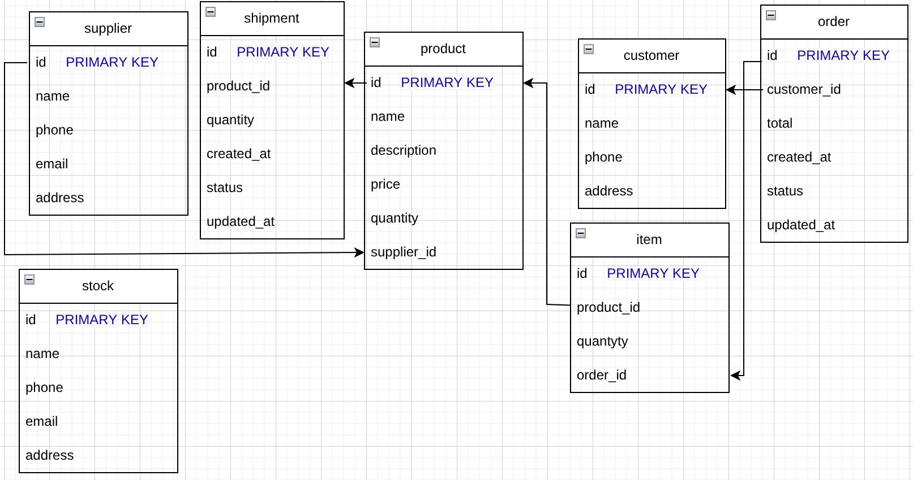

# Совместный проект СПР

## Структура БД


## Структура проект
- `src/database` - настройки базы данных
- `src/models` - модели таблиц
- `src/repositories` - репозитории под модели
- `src/routes` - эндпоинты нашего API
- `src/services` - сервисы под репозитории
- `src/main.go` - файл старта проекта

## Запуск проекта
Делаем билд проекта с помощью Docker
```shell
docker build
```

И затем можно запускать исполнительный файл
```shell
./project //Если скомпилировали в Windows - `./project.exe`
```